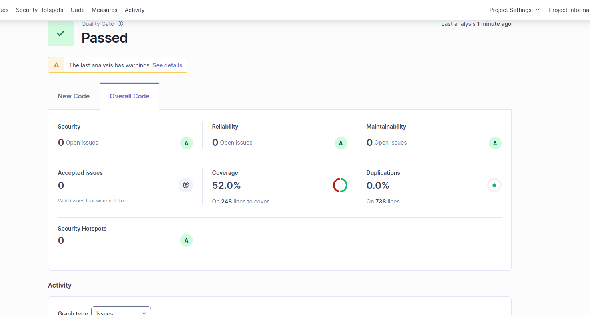

La API permite realizar **CRUD básico** de:

- **Teachers (docentes)**
- **Students (estudiantes)** por docente

Sin base de datos — todo se almacena en memoria.

---


## Resultados de calidad y análisis SonarQube

### Calidad requerida


### Resultado del alumno en SonarQube


## 🚀 1. Requisitos

- Python 3.10+
- pip

---

## 📦 2. Instalación del proyecto

```bash
pip install fastapi uvicorn
